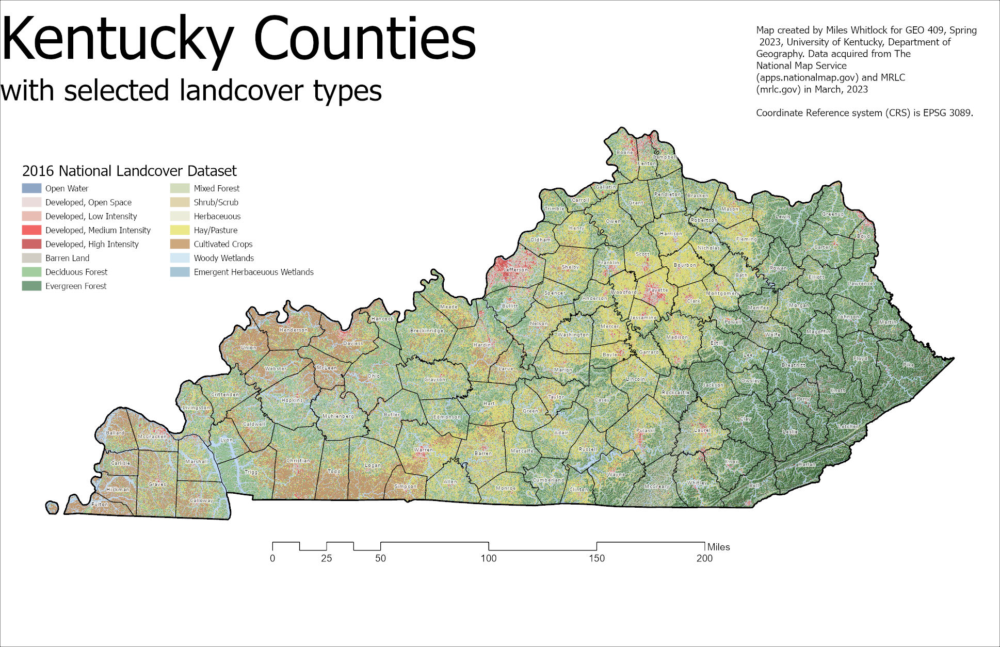

# GEO409 Field Trip Maps
Maps for field trip to measure tree canopy

   
Kentucky counties with selected land cover types – [Download geospatial PDF](kentucky_counties.pdf)

   
UKy central campus canopy model – [Download geospatial PDF](tree_canopy_willyt.pdf)

Maps created by Miles Whitlock for GEO409, Spring 2023, University of Kentucky Department of Geography
